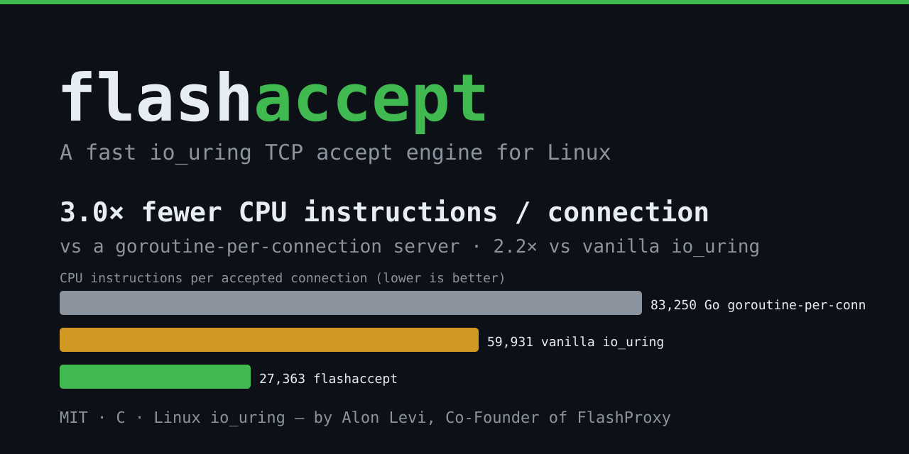

<p align="center"></p>

<p align="center">
  <b>A fast io_uring TCP accept engine for Linux.</b><br>
  Accepts connections for <b>~3× fewer CPU instructions</b> than a goroutine-per-connection server,
  and <b>~2.2× fewer</b> than vanilla io_uring.
</p>

<p align="center">
  <a href="LICENSE"></a>
  
  
</p>

---

High-churn services spend a shocking fraction of their CPU just **accepting** connections —
`accept`/`read`/`write`/`close`, one syscall each, per connection. `flashaccept` collapses that
cost with a tuned io_uring accept path (multishot accept, registered/direct descriptors, a
per-worker connection freelist, and `MSG_MORE` reply+FIN fusion), so each connection costs a
fraction of the CPU.

It is **drop-in and importable** — link `libflashaccept`, give it a port and a request handler,
and it runs an optimized accept loop per core.

## Benchmark


Loopback, one pinned core, CPU-bound, fixed 512 in-flight, ~2–3% spread:

| server | instructions / connection | conn/s (1 core) | vs Go | vs vanilla io_uring |
|---|---:|---:|---:|---:|
| Go, goroutine-per-connection | 83,250 | 60,131 | 1.00× | — |
| vanilla io_uring | 59,931 | 147,946 | 1.39× | 1.00× |
| **flashaccept** | **27,363** | **361,282** | **3.04×** | **2.19×** |

Full methodology and caveats: [docs/BENCHMARKS.md](docs/BENCHMARKS.md).

## Quick start

```bash
git clone https://github.com/thealonlevi/flashaccept.git && cd flashaccept
sudo apt-get install -y liburing-dev build-essential
make                       # libflashaccept.a + libflashaccept.so
make examples && ./examples/echo_server --port 8080
```

```c
#include <flashaccept.h>
#include <string.h>

/* Called when request bytes arrive. Write the reply, return its length to
   send-then-close (return 0 to close without a reply). */
static int handle(const char *req, int req_len, char *reply, int cap, void *user) {
    const char *r = "HTTP/1.1 200 OK\r\nContent-Length: 0\r\n\r\n";
    int n = (int)strlen(r);
    memcpy(reply, r, n);
    return n;
}

int main(void) {
    fa_config cfg = { .port = 8080, .multishot = 1, .direct_files = 1 }; /* workers=0 => one/core */
    fa_server *s = fa_server_new(&cfg, handle, NULL);
    return fa_server_run(s);   /* blocks; one optimized io_uring accept loop per core */
}
```
```bash
cc myserver.c -o myserver -lflashaccept -luring -lpthread
```

Requires Linux with io_uring (kernel ≥ 5.x; multishot accept uses ≥ 5.19, with graceful fallback)
and liburing. Full reference: [docs/API.md](docs/API.md).

## How it works

`flashaccept` runs one `io_uring` instance and one `SO_REUSEPORT` listening socket per worker
(one per core by default); the kernel load-balances accepts across them. The hot path uses:

- **multishot accept** — one SQE yields many accept completions
- **registered files / direct descriptors** — accept into the ring's table, skip fd-table churn
- **per-worker connection freelist** — no per-connection `malloc`
- **`MSG_MORE` reply+FIN fusion** — the reply and the connection's FIN ship as one TCP segment
- **batched submit/harvest** — one `io_uring_enter` drives many connections

## How it was built

flashaccept's accept engine wasn't hand-tuned — it was **discovered by an autonomous optimizer**
that mutated a baseline io_uring server in a closed loop, scored each change on CPU instructions
per connection, and kept only what won. The complete, reproducible research rig (benchmark, the
Go baseline it was measured against, the metrics, and the AI optimization loop) lives in
**[`research/`](research/)** — including the full story of how vanilla io_uring became 2.2× leaner.

## About

Created by **Alon Levi**, Co-Founder of **FlashProxy**. Born out of making FlashProxy's
connection-accept path cheaper at scale.

https://flashproxy.com/
https://www.linkedin.com/in/thealonlevi/
alon@flashproxy.io


## License

MIT — see [LICENSE](LICENSE).
